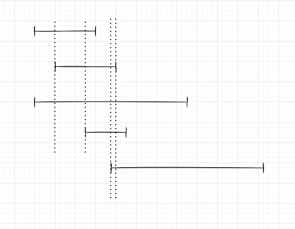

# Тестовое задание для компании PRLS(Название изменено)

### Задание 1

В первой задаче было необходимо написать функцию на PHP,  
которая принимает на вход матрицу вещественных чисел (единственный параметр)  
и возвращает её ранг.  Попросили не использовать библиотечные классы   
и методы для работы с матрицами.  
А также не использовать цикл "for".

Я подумал, что одним методом здесь не обойтись   
(иначе он получился бы слишком громовским). Более того, если вернуться к такому коду спустя месяц, его невозможно будет понять в течении 5-10 минут.

Решил проблему в объектном стиле, поскольку   
такой метод помогает абстрагироваться от реализации и сосредоточиться   
на понимании процесса, который выражен во взаимодействии между собой объектов.

Нужно также помнить, что не было поставлено задачи производительности,   
следовательно код может быть менее производительным чем   
в тех же библеотечных классах. а также здесь возможно избыточные циклы.

Основные объекты это Матрица, Определитель, окомляющие миноры, и минор.

Соответственно, задачу я решил с помощью метода окомляющего минора.   
Т.к. я использовал объекты, то - эти объекты можно использовать повторно в других задачах , например, можно переиспользовать определитель.

Также можно легко расширить код в любом месте. добавив в систему декораторы.

Итого: на мой взгляд код легко расширяем, и заменяем.

---
### Задание 2
Есть таблица Session.
id, user_id, login_time, logout_time
В ней хранится id пользователя, время входа и время выхода из системы (может быть null, если визит еще не завершен). Определить в какое время за отдельно взятые сутки в системе находилось одновременно максимальное число пользователей.
Ответ: Скрипт на языке PHP, на вход принимает дату. Будут учитываться красота и оптимальность  SQL запроса и алгоритма расчета, а также полнота выдаваемого скриптом ответа.

<b>Таблица будет создана, после применения миграций.</b>

Вторую задачу я планировал решить следующим способом:
представим что сессия это некоторый таймлайн, который характеризуется началом,
концом, и пользователем (его идентификатором). Следовательно, нам осталось вычислить максимальное "пересечение таймлайнов"
Этот способ также поможет получить 
нам максимальную продолжительность с максимальной посещаемостью

Чтобы запустить модуль в своей среде необходимо:

1.  Установить Docker-compose
2.  Перейти в дирректорию docker
3.  Создать файл .env (можно скопирвоать из образца)
4.  Добавить в hosts файл домен указанный в .env файле, связать его с ип `127.0.0.1`
5.  Запустить `docker-compose up -d`
6.  Для быстрого доступа к апи, используйте postman [https://www.postman.com/solar-robot-131180/workspace/test/folder/2231425-91858562-a64a-4af8-984a-a9346b0dc647](https://www.postman.com/solar-robot-131180/workspace/test/folder/2231425-91858562-a64a-4af8-984a-a9346b0dc647)

После установки всех зависимостей модуль будет доступен по указанному вами домену, у меня это `PRLS.my:83`

миграции и пр. применятся автоматически.